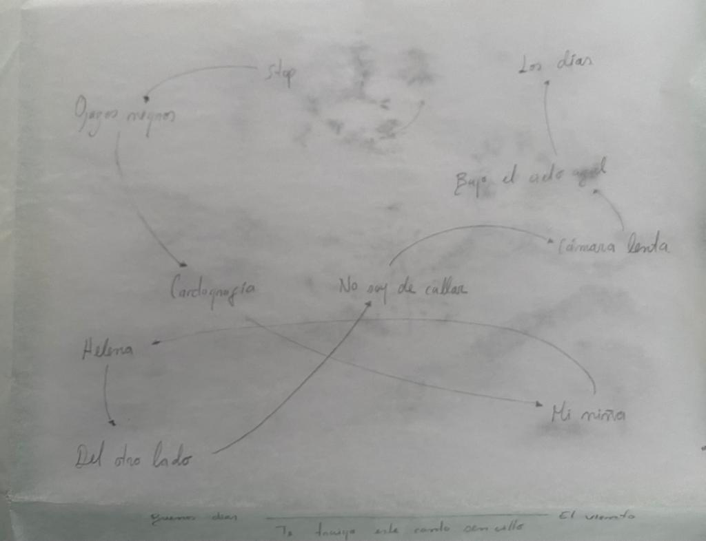

# Visuales para Ana María Vahos Festival Estereo Picnic 2023

Animación modular para visuales en vivo. Concierto de Ana María Vahos en el Festival Estereo Picnic 2023.

[a5722238-678a-423e-a97b-25c75eacdd56.webm](https://user-images.githubusercontent.com/4657617/227040175-b98bccd4-93cb-401e-a1c4-d39d0ec75070.webm)

## Equipo

Diego Cortés  
Antonia Bustamante  
Juan Camilo González

Issabella Rozo  
Mariana Díaz  
Daniel Hoyos

